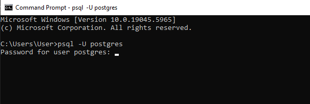
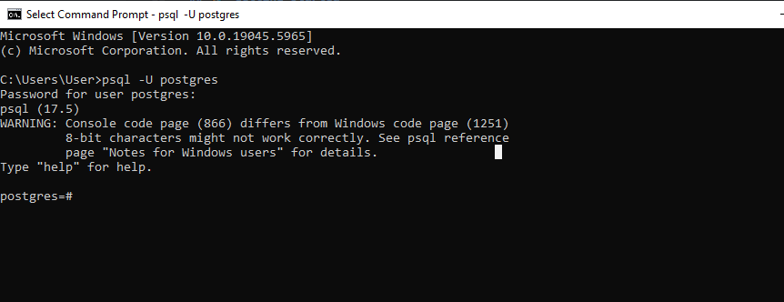
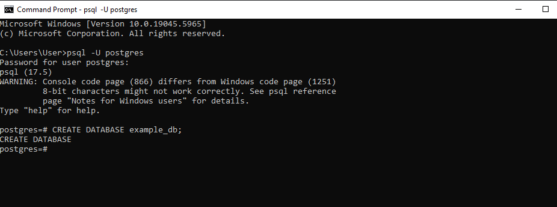
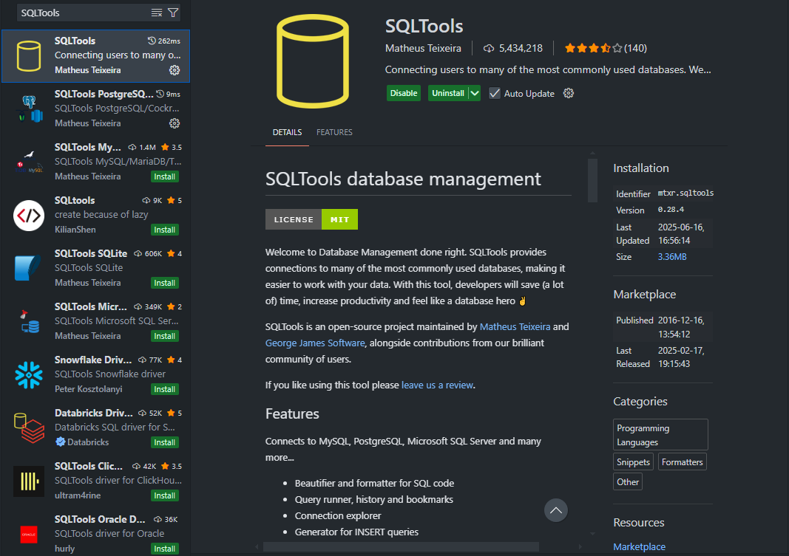
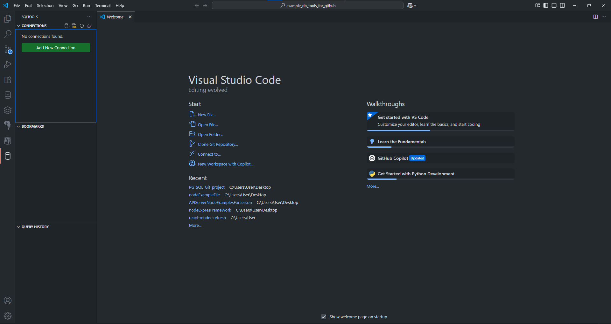
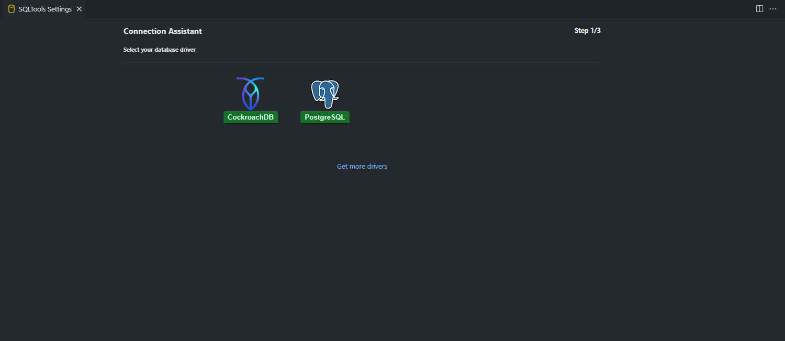
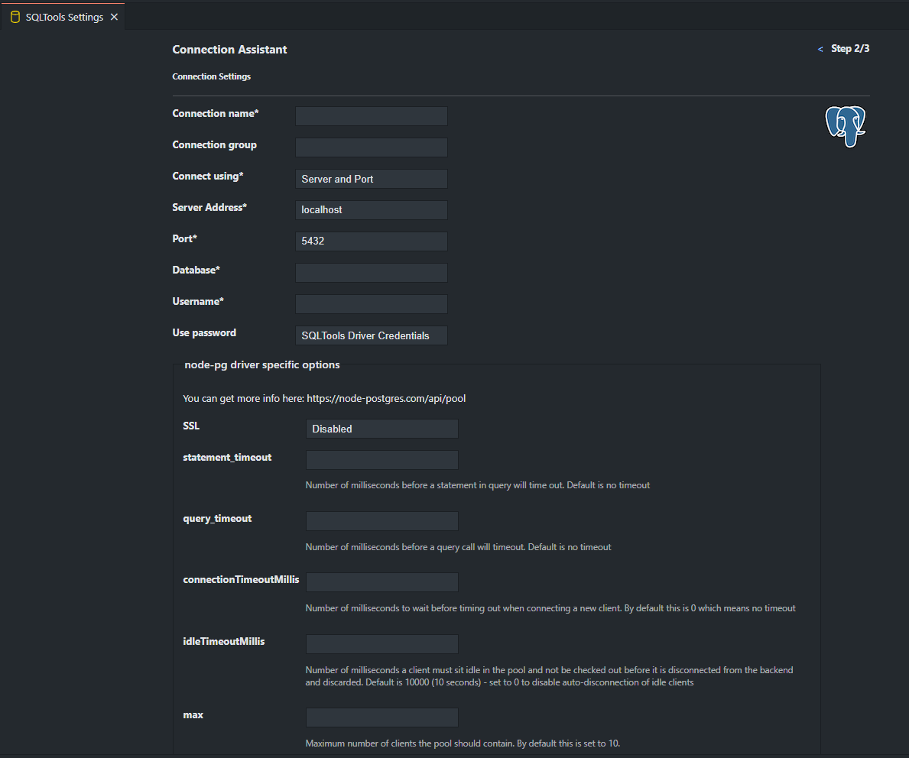
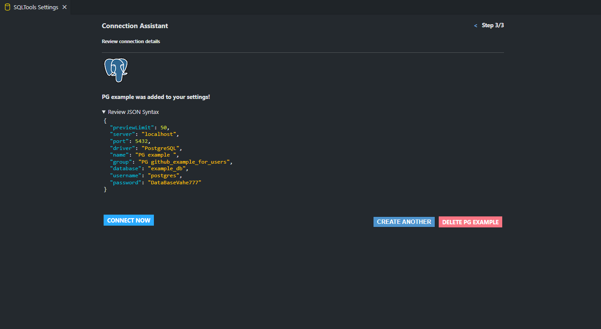

# 🛠️ PostgreSQL More Example's

## 📚 Description 

This project introduces many PostgreSQL commands and topics, how they work, etc. It is very suitable for beginners to learn. Only PostgreSQL was used in this project.I used SQLTools in this project.

--- 

## 🛠️ Key Technologies

* **PostgreSQL:** A program for working with databases․

##  PostgreSQL

Before looking at the code, I recommend you read this.
 
First, let's understand what PostgreSQL is. It is a program designed to work with databases. It is a very convenient and powerful program, and many programmers prefer PostgreSQL.There are a few things in the code that I haven't talked about in depth, such as data types. Some of the most common and used data types in PostgreSQL are BOLEAN, TEXT, etc. BOLEAN stores two values, either TRUE or FALSE, and TEXT stores text of any length.

There are other common commands in PostgreSQL that are very useful, for example UNIQUE makes all rows unique. Or DEFAULT sets some default value for some column, that is, if a value is not given to that column, it accepts that default value.

## 🚀 Getting Started

Follow the instructions below to set up and run this project locally.

### Prerequisites
* [PostgreSQL](https://www.postgresql.org/)

Before proceeding, you need to download PostgreSQL.

### Creating Database For PostgreSQL

1. Open your Terminal (for MacOS/Linux) or Command Prompt/PowerShell (for Windows).

2. type in terminal psql -U %USERNAME% (Replace %USERNAME with your PostgreSQL account name.)

3. After writing your PostgreSQL name, you will see something like this. You should write your PostgreSQL Password there and if you see that nothing is written there, don't worry because it is intended for privacy, just write your Password and press Enter.

    

4. Once you are logged in to your PostgreSQL account, you can create a database in your account by typing CREATE DATABASE %DATABASE NAME%; where %DATABASE NAME% should be the name of your database, which you can set, but it is recommended to set a sensible name.

    

5. Once the database is created, you will see CREATE DATABASE, which means you have successfully created the database as shown in the image below and all we have to do is connect our database to SQLTools

    

6. Before we can connect SQLTools to our database, we need to drag the SQLTools extension into our VS Code. To do this, open the extensions section or simply press ctrl shift x on your keyboard and it will automatically open the extensions section. There, type SQLTools and drag it in. When you do, you should see what is shown in the image.
    

7. Once you open SQLTools you will see something like this
    
    
   you need to click Add New Connection

8. When you click Add New Connection, a dialog box will open where you need to select PostgreSQL, as shown in the image below.

    

9. If you see what is shown, congratulations, you have almost reached the end, all that remains is to connect the database with SQLTools. First, before connecting, there are fields in the picture that need to be filled in, which I will now tell you what you need to fill in.

    

In the Connection name field, you must enter the name of the connection. You can use any name you like, but it should be a sensible name.

In the Connection group field, you must enter the name of the group. You can use any name you like, but it should be a reasonable name.

You can leave the Connect using, Server Address, Port fields unchanged if you haven't changed them since installing PostgreSQL.

In the Database field, you should write the name of the database we created earlier, which we created by logging into our PostgreSQL account in cmd. In my example, the name of my database is example_db

In the Username field, you must enter the name of your PostgreSQL account.

The Use Password field is automatically set to SQLTools Driver Credentials but we need to change it to Save as plaintext in settings and we will see a new field added below called Password and there we need to write the Password of our PostgreSQL account.

Once you have filled in all these fields, you should click Test Connection as shown in the image below.

if you see this text in red

So you have filled in one or more of the fields incorrectly, and if you see this text in green:

then everything worked just click Save Connection and you will see this

here you need to click Connect Now and that's it, you can now write your database code!!!)))

